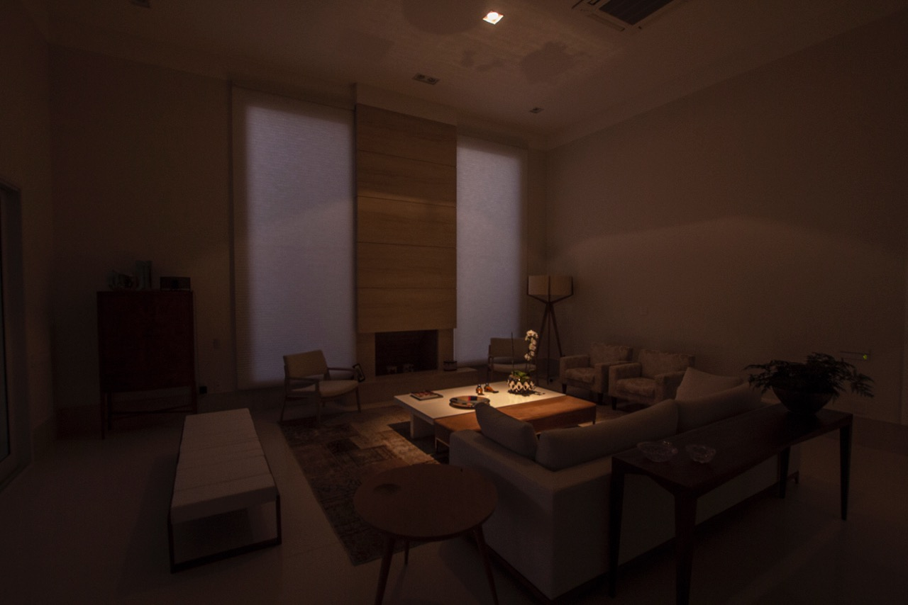

Simulador de Interruptor

Este é um projeto simples de um simulador de interruptor que liga e desliga uma lâmpada virtual. O projeto utiliza HTML, CSS e JavaScript puro para manipular o DOM e alternar entre os estados de luz ligada e desligada.

Descrição

O simulador de interruptor possui as seguintes funcionalidades:
- Alternar entre os estados de luz ligada e desligada ao clicar no botão.
- Alterar o plano de fundo para representar um quarto com luz ligada ou desligada.
- Contar o número de vezes que a luz foi acesa.
- Transições suaves para a troca de imagens e plano de fundo.

Imagens

Luz Desligada

Quarto Luz Desligada

Luz Ligada

Quarto Luz Ligada

Como modificar a imagem usada

1. Substitua as imagens `desligada2.jpg` e `ligada2.jpg` no diretório do projeto por outras imagens de sua preferência.
2. Certifique-se de que as novas imagens tenham o mesmo nome ou atualize os caminhos no arquivo `style.css`:
   css
   body {
       background-image: url('nova-imagem-desligada.jpg');
   }

   body.luz-ligada {
       background-image: url('nova-imagem-ligada.jpg');
   }
